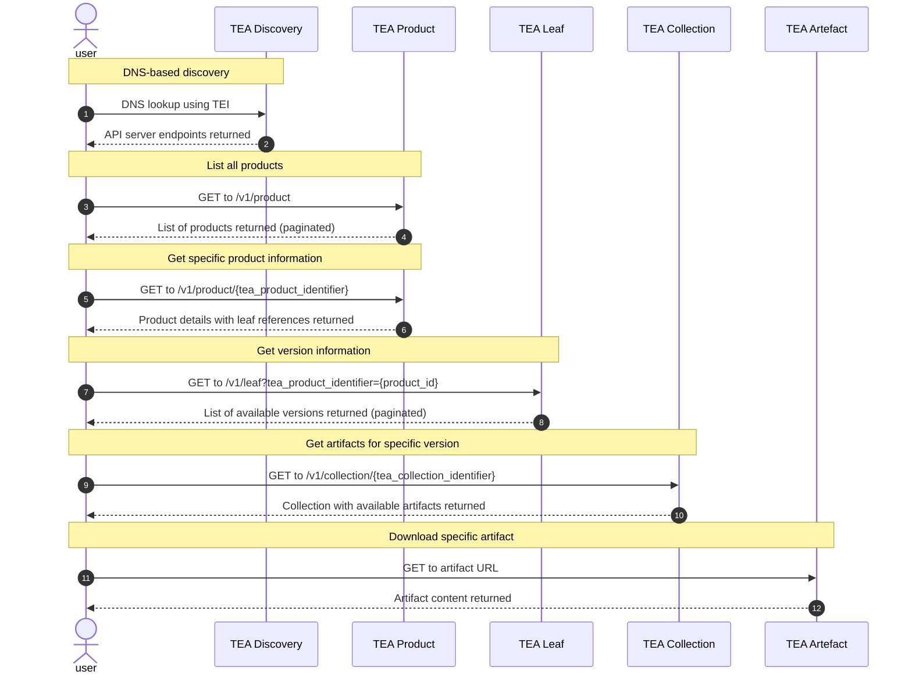
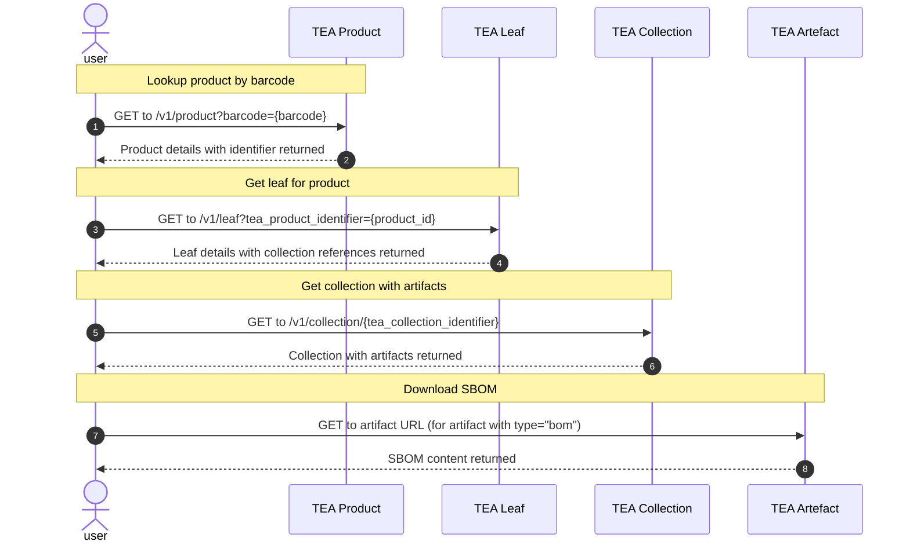

# Transparency Exchange API: Consumer access

The consumer access starts with a TEI, A transparency Exchange Identifier. This
is used to find the API server as described in the
[discovery document](/discovery/readme.md).

## API usage

The standard TEI points to a product.

- **List of TEA leafs**: Leafs are components of something sold. Each leaf has
  it's own versioning and it's own set of artefacts. Note that a single artefact
  can belong to multiple versions of a leaf and multiple leafs.
- **List of TEA collections**: For each leaf, there is a list of TEA collections
  as indicated by release date and a version string. The TEA API has no
  requirements of type of version string (semantic or any other scheme) - it's
  just an identifier set by the manufacturer. It's sorted by release date as a
  default.
- **List of TEA artefacts**: The collection is unique for a version and contains
  a list of artefacts. This can be SBOM files, VEX, SCITT, IN-TOTO or other
  documents.
- **List of artefact formats**: An artefact can be published in multiple
  formats.

The user has to know product TEI and version of each component (TEA LEAF) to
find the list of artefacts for the used version.

## API flow

## Simplified workflow: Retrieving the latest SBOM using a TEI (EAN barcode)

For many consumer use cases, the goal is simply to retrieve the latest SBOM for a product identified by a TEI (such as an EAN barcode). Here's a simplified workflow for this common scenario:

This simplified workflow focuses on the most common consumer use case: retrieving the latest SBOM for a product using its TEI (such as an EAN barcode). The process involves:

1. Querying the product API with the TEI (barcode) to get the product identifier
2. Retrieving the latest leaf version by sorting by release date
3. Getting the collection for that leaf version
4. Downloading the SBOM artifact from the collection

This approach minimizes the number of API calls needed while ensuring the consumer gets the most up-to-date SBOM information available for the product.
