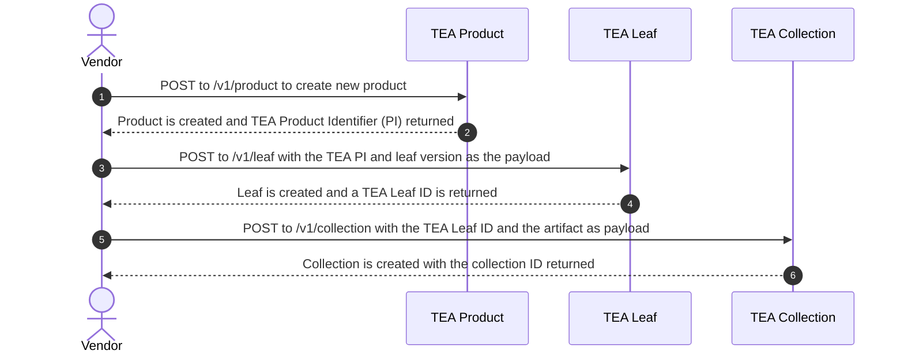
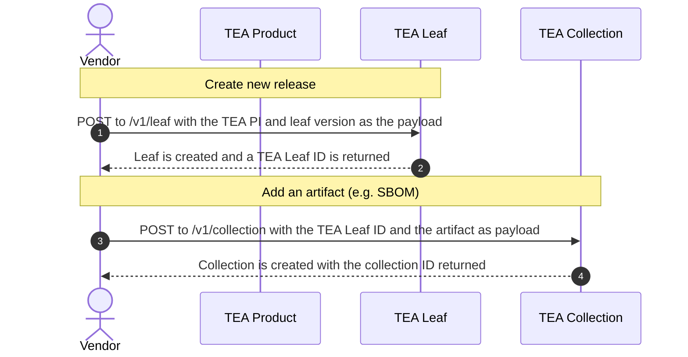
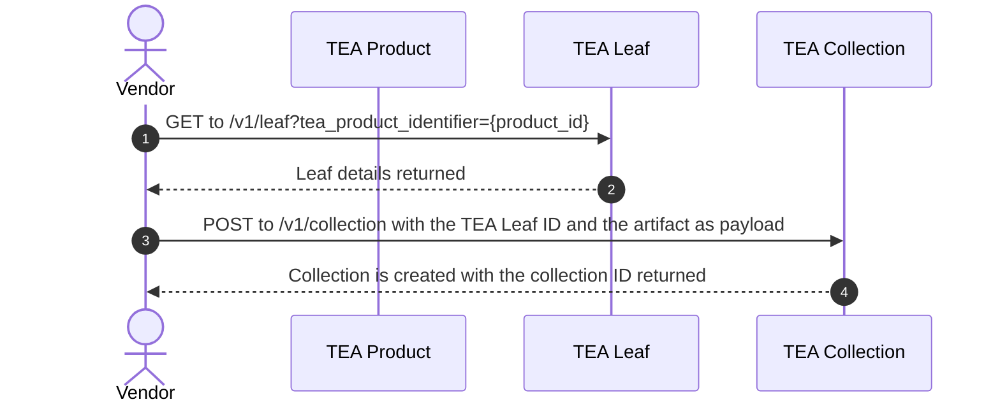
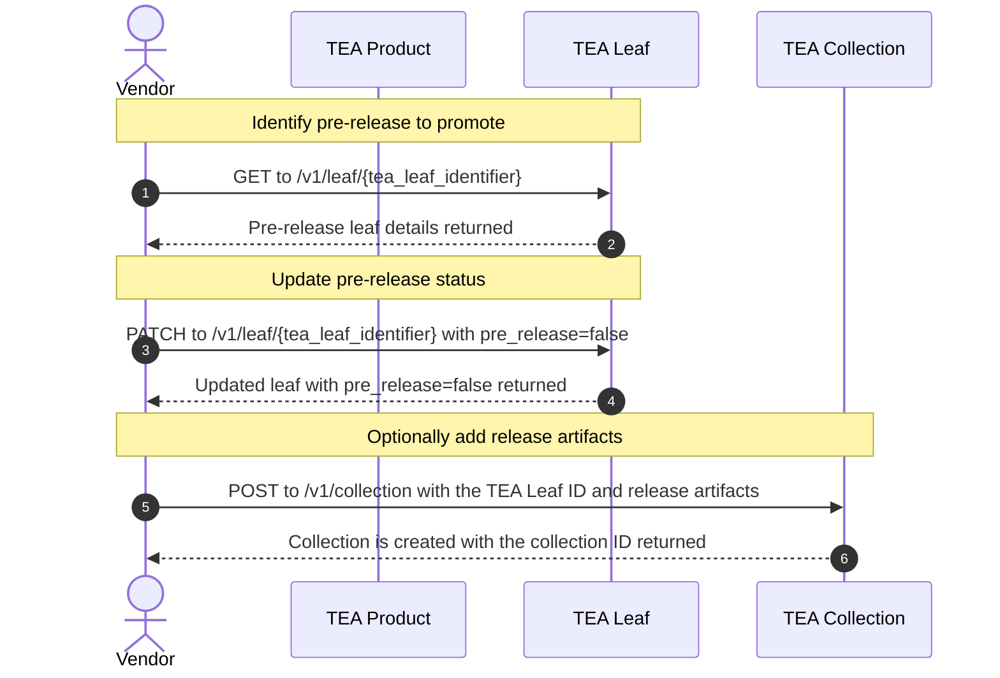

# Overview of the TEA API from a producer standpoint

## Bootstrapping

```mermaid
sequenceDiagram
    autonumber
    actor Vendor
    participant tea_product as TEA Product
    participant tea_leaf as TEA Leaf
    participant tea_collection as TEA Collection

    Vendor ->> tea_product: POST to /v1/product to create new product
    tea_product -->> Vendor: Product is created and TEA Product Identifier (PI) returned

    Vendor ->> tea_leaf: POST to /v1/leaf with the TEA PI and leaf version as the payload
    tea_leaf -->> Vendor: Leaf is created and a TEA Leaf ID is returned

    Vendor ->> tea_collection: POST to /v1/collection with the TEA Leaf ID and the artifact as payload
    tea_collection -->> Vendor: Collection is created with the collection ID returned
```

## Release life cycle

```mermaid
sequenceDiagram
    autonumber
    actor Vendor
    participant tea_product as TEA Product
    participant tea_leaf as TEA Leaf
    participant tea_collection as TEA Collection

    Note over Vendor,tea_leaf: Create new release

    Vendor ->> tea_leaf: POST to /v1/leaf with the TEA PI and leaf version as the payload
    tea_leaf -->> Vendor: Leaf is created and a TEA Leaf ID is returned

    Note over Vendor,tea_collection: Add an artifact (e.g. SBOM)
    Vendor ->> tea_collection: POST to /v1/collection with the TEA Leaf ID and the artifact as payload
    tea_collection -->> Vendor: Collection is created with the collection ID returned
```

## Adding a new artifact

```mermaid
sequenceDiagram
    autonumber
    actor Vendor
    participant tea_product as TEA Product
    participant tea_leaf as TEA Leaf
    participant tea_collection as TEA Collection

    Vendor ->> tea_leaf: GET to /v1/leaf?tea_product_identifier={product_id}
    tea_leaf -->> Vendor: Leaf details returned

    Vendor ->> tea_collection: POST to /v1/collection with the TEA Leaf ID and the artifact as payload
    tea_collection -->> Vendor: Collection is created with the collection ID returned
```

## Promoting a pre-release to a release

```mermaid
sequenceDiagram
    autonumber
    actor Vendor
    participant tea_product as TEA Product
    participant tea_leaf as TEA Leaf
    participant tea_collection as TEA Collection

    Note over Vendor,tea_leaf: Identify pre-release to promote

    Vendor ->> tea_leaf: GET to /v1/leaf/{tea_leaf_identifier}
    tea_leaf -->> Vendor: Pre-release leaf details returned

    Note over Vendor,tea_leaf: Update pre-release status

    Vendor ->> tea_leaf: PATCH to /v1/leaf/{tea_leaf_identifier} with pre_release=false
    tea_leaf -->> Vendor: Updated leaf with pre_release=false returned

    Note over Vendor,tea_collection: Optionally add release artifacts

    Vendor ->> tea_collection: POST to /v1/collection with the TEA Leaf ID and release artifacts
    tea_collection -->> Vendor: Collection is created with the collection ID returned
```
